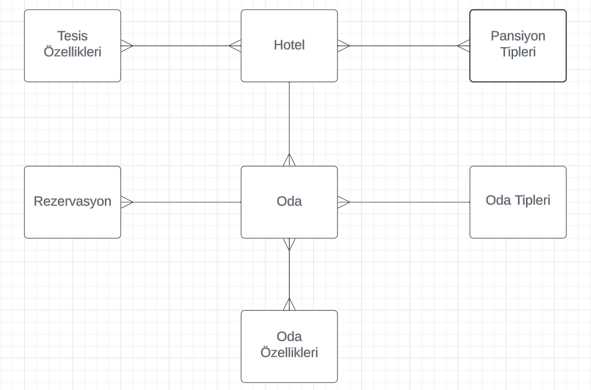

# Tourism Agency API

Bu proje, bir turizm ajansının otel yönetimi için geliştirilmiş bir RESTful API'yi içermektedir. Aşağıda API endpoint'lerini ve kullanımını gösteren bir rehber bulunmaktadır.

Öncelikle sisteme bir otel eklenmelidir. Sonrasında bu otele ait odalar eklenmektedir. Odalar eklendikten sonra bu odalara rezervasyon yapılabilmektedir.

Odanın stoğu 0 ise rezervasyon yapılamaz ve odanın müsait gün aralığı dışında rezervasyon eklenemez.

## Facility (Tesis) API Endpoint'leri

- **Yeni Tesis Ekleme**
    - Endpoint: `POST /v1/facility`
    - Açıklama: Yeni bir tesis ekler.

- **Tesis Bilgisi Getirme**
    - Endpoint: `GET /v1/facility/{id}`
    - Açıklama: Belirtilen ID'ye sahip tesisin bilgilerini getirir.

- **Tüm Tesisleri Getirme**
    - Endpoint: `GET /v1/facility/all`
    - Açıklama: Tüm tesislerin bilgilerini getirir.

## Hostel API Endpoint'leri

- **Yeni Hostel Ekleme**
    - Endpoint: `POST /v1/hostel`
    - Açıklama: Yeni bir hostel ekler.

- **Hostel Bilgisi Getirme**
    - Endpoint: `GET /v1/hostel/{id}`
    - Açıklama: Belirtilen ID'ye sahip hostelın bilgilerini getirir.

- **Tüm Hostelleri Getirme**
    - Endpoint: `GET /v1/hostel/all`
    - Açıklama: Tüm hostel'ların bilgilerini getirir.

## Hotel (Otel) API Endpoint'leri

- **Yeni Otel Ekleme**
    - Endpoint: `POST /v1/hotel`
    - Açıklama: Yeni bir otel ekler.

- **Otel Bilgisi Getirme**
    - Endpoint: `GET /v1/hotel/{id}`
    - Açıklama: Belirtilen ID'ye sahip otelin bilgilerini getirir.

- **Otel Silme**
    - Endpoint: `DELETE /v1/hotel/{id}`
    - Açıklama: Belirtilen ID'ye sahip oteli siler.

- **Otel Güncelleme**
    - Endpoint: `PUT /v1/hotel`
    - Açıklama: Belirtilen oteli günceller.

- **Otel Adına Göre Arama**
    - Endpoint: `GET /v1/hotel/{name}`
    - Açıklama: Belirtilen otel adına göre arama yapar.

- **Tüm Otelleri Getirme**
    - Endpoint: `GET /v1/hotel/all`
    - Açıklama: Tüm otellerin bilgilerini getirir.

## Reservation (Rezervasyon) API Endpoint'leri

- **Yeni Rezervasyon Ekleme**
    - Endpoint: `POST /v1/reservation`
    - Açıklama: Yeni bir rezervasyon ekler.

- **Rezervasyon Bilgisi Getirme**
    - Endpoint: `GET /v1/reservation/{id}`
    - Açıklama: Belirtilen ID'ye sahip rezervasyonun bilgilerini getirir.

- **Rezervasyon Silme**
    - Endpoint: `DELETE /v1/reservation/{id}`
    - Açıklama: Belirtilen ID'ye sahip rezervasyonu siler.

- **Rezervasyon Güncelleme**
    - Endpoint: `PUT /v1/reservation`
    - Açıklama: Belirtilen rezervasyonu günceller.

- **Tüm Rezervasyonları Getirme**
    - Endpoint: `GET /v1/reservation/all`
    - Açıklama: Tüm rezervasyonların bilgilerini getirir.

## Room (Oda) API Endpoint'leri

- **Yeni Oda Ekleme**
    - Endpoint: `POST /v1/room`
    - Açıklama: Yeni bir oda ekler.

- **Oda Bilgisi Getirme**
    - Endpoint: `GET /v1/room/{id}`
    - Açıklama: Belirtilen ID'ye sahip odanın bilgilerini getirir.

- **Oda Silme**
    - Endpoint: `DELETE /v1/room/{id}`
    - Açıklama: Belirtilen ID'ye sahip odayı siler.

- **Oda Güncelleme**
    - Endpoint: `PUT /v1/room`
    - Açıklama: Belirtilen odayı günceller.

- **Otel Adına Göre Odaları Listeleme**
    - Endpoint: `GET /v1/room/filter/{hotelName}`
    - Açıklama: Belirtilen oteldeki odaları listeler.

- **Tarih Aralığına Göre Odaları Listeleme**
    - Endpoint: `GET /v1/room/date`
    - Açıklama: Belirtilen tarih aralığındaki odaları listeler.

- **Tüm Odaları Getirme**
    - Endpoint: `GET /v1/room/all`
    - Açıklama: Tüm odaların bilgilerini getirir.

## Room Features (Oda Özellikleri) API Endpoint'leri

- **Yeni Oda Özelliği Ekleme**
    - Endpoint: `POST /v1/room-features`
    - Açıklama: Yeni bir oda özelliği ekler.

- **Tüm Oda Özelliklerini Getirme**
    - Endpoint: `GET /v1/room-features/all`
    - Açıklama: Tüm oda özelliklerinin bilgilerini getirir.

## Room Types (Oda Tipleri) API Endpoint'leri

- **Yeni Oda Tipi Ekleme**
    - Endpoint: `POST /v1/room-types`
    - Açıklama: Yeni bir oda tipi ekler.

- **Tüm Oda Tiplerini Getirme**
    - Endpoint: `GET /v1/room-types/all`
    - Açıklama: Tüm oda tiplerinin bilgilerini getirir.

## Teknolojiler
* Java
* Spring Boot
* Maven
* MySQL
* REST API
* Swagger
* Postman
* IntelliJ IDEA
* Git
* GitHub

